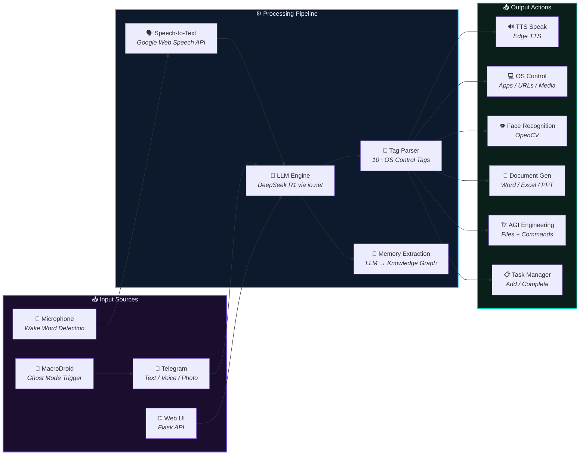
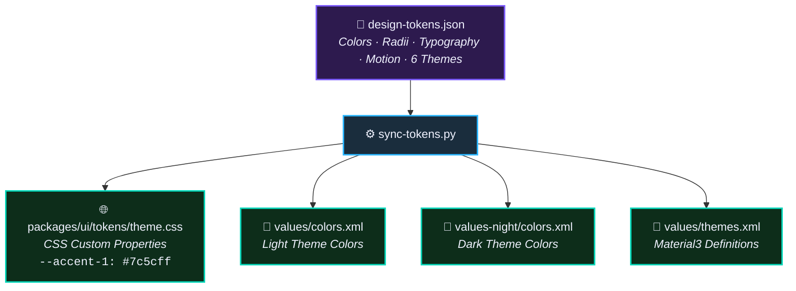
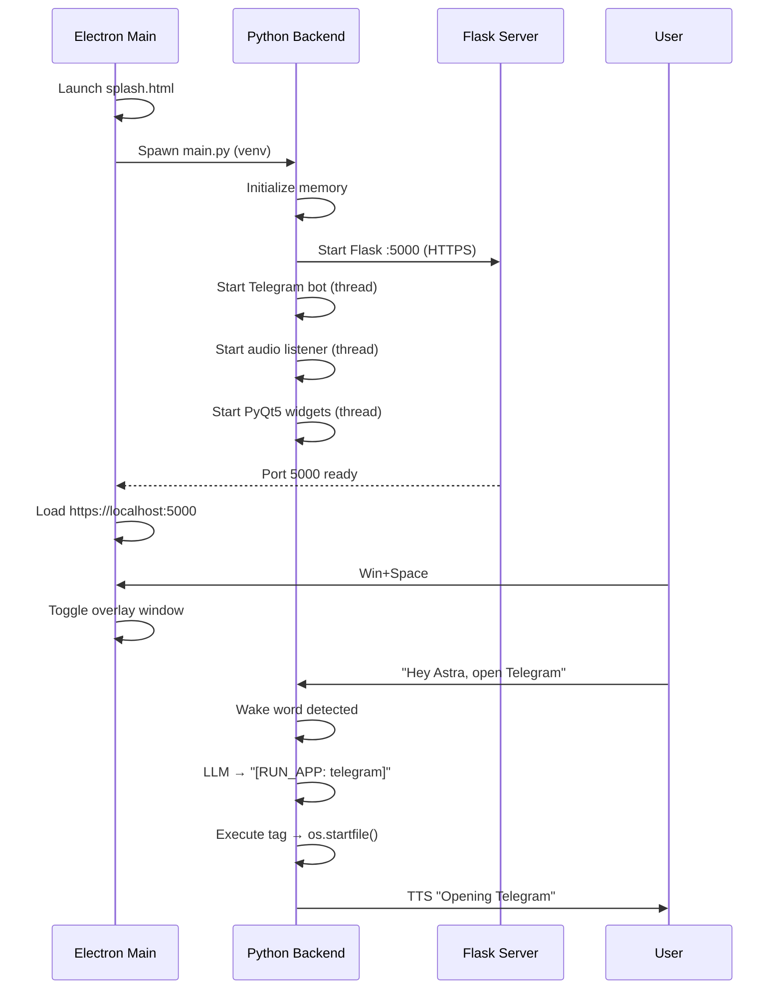
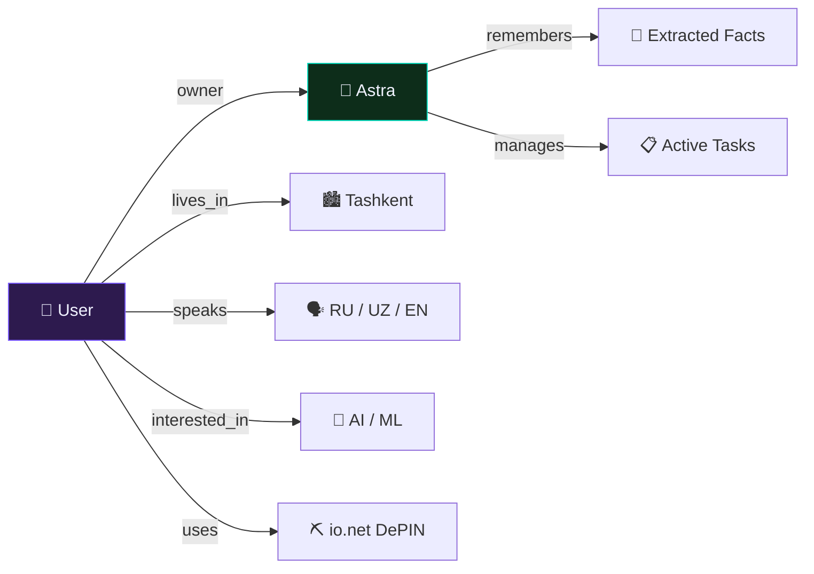

<div align="center">

# ✦ ASTRA — Next-Gen AI Assistant ✦

**Full-Stack Multi-Platform AGI Personal Assistant**

*Web Prototype · Desktop (Electron + Python) · Android (Native Java) · Telegram Bot*

[](LICENSE)
[](#)
[](#)
[](#)
[](#)
[](#)

---

Astra is an AI personal assistant that lives on the user's devices, offering a **voice-first, multi-modal, and proactive** workspace experience with OS-level control, document generation, face recognition, smart home automation, knowledge graph memory, and DePIN GPU monitoring.

</div>

---

## 📐 High-Level System Architecture

```mermaid
graph TB
    subgraph USER["👤 User Interfaces"]
        WEB["🌐 Web Prototype<br/><i>React/JSX via CDN Babel</i>"]
        ELECTRON["🖥️ Desktop Client<br/><i>Electron v31 + Glass HUD Overlay</i>"]
        ANDROID["📱 Android Client<br/><i>Native Java · SDK 34</i>"]
        TELEGRAM["💬 Telegram Bot<br/><i>python-telegram-bot</i>"]
    end

    subgraph BACKEND["⚙️ Python Backend Engine (TTS-AGI-BOT)"]
        MAIN["🧠 main.py<br/><i>Orchestrator</i>"]
        FLASK["🌐 Flask Server<br/><i>HTTPS :5000</i>"]
        LLM["🤖 LLM Client<br/><i>io.net · DeepSeek R1</i>"]
        TTS["🔊 TTS Engine<br/><i>Edge TTS · Aria/Svetlana</i>"]
        LISTENER["🎤 Wake Word Listener<br/><i>sounddevice · Google STT</i>"]
        MEMORY["🧬 Memory Manager<br/><i>Knowledge Graph JSON</i>"]
        TASKS["📋 Task Manager<br/><i>CRUD · JSON Store</i>"]
        VISION["👁️ Face Detector<br/><i>OpenCV · face_recognition</i>"]
        DOCS["📄 Doc Generator<br/><i>Word · Excel · PPT</i>"]
        IONET["⛏️ io.net DePIN<br/><i>GPU Worker Monitor</i>"]
        WIDGETS["🖼️ PyQt5 Overlay<br/><i>Neon Waveform HUD</i>"]
    end

    subgraph SHARED["📦 Shared Packages"]
        CORE_THEMES["🎨 core/themes<br/><i>Theme Presets · applyTheme()</i>"]
        CORE_AI["🤖 core/ai<br/><i>ModelRegistry · Adapters</i>"]
        CORE_INTENTS["🧭 core/intents<br/><i>IntentRouter · Bilingual NLU</i>"]
        UI_COMPONENTS["🧩 ui/components<br/><i>7 TSX Components</i>"]
        UI_SCREENS["📱 ui/screens<br/><i>8 TSX Screens</i>"]
        TOKENS["🎨 Design Tokens<br/><i>design-tokens.json</i>"]
    end

    USER --> BACKEND
    ELECTRON -->|"spawns process"| MAIN
    ELECTRON -->|"loads HTTPS UI"| FLASK
    WEB --> FLASK
    TELEGRAM --> MAIN

    MAIN --> LLM
    MAIN --> TTS
    MAIN --> LISTENER
    MAIN --> MEMORY
    MAIN --> TASKS
    MAIN --> VISION
    MAIN --> DOCS
    MAIN --> WIDGETS
    FLASK --> IONET

    TOKENS -->|"sync-tokens.py"| UI_COMPONENTS
    TOKENS -->|"sync-tokens.py"| ANDROID

    style USER fill:#1a1040,stroke:#7c5cff,stroke-width:2px,color:#f0f2ff
    style BACKEND fill:#0d1a2d,stroke:#00d6b8,stroke-width:2px,color:#f0f2ff
    style SHARED fill:#0d1025,stroke:#2bb6ff,stroke-width:2px,color:#f0f2ff
```



---

## 🗂️ Project Directory Structure

```
Astra/
├── 📁 AI Assistent UI/              ← Original Web Prototype (JSX + CSS)
│   ├── Astra.html                   Entry HTML page
│   ├── app.jsx                      App shell, themes, parallax, HUD decorations
│   ├── astra-avatar.jsx             14×14 pixel-art face, orb, listening ripple
│   ├── i18n.jsx                     Full bilingual dictionary (RU/EN)
│   ├── icons.jsx                    30+ SVG icon components
│   ├── particles.jsx                Canvas pixel particle system with depth
│   ├── screen-home.jsx              Home: orb, mic, quick actions, status
│   ├── screen-chat.jsx              Chat with action cards (route ETA/distance)
│   ├── screen-calendar.jsx          Weekly strip calendar + events + tasks
│   ├── screen-auto.jsx              Automation routines with smart icons
│   ├── tweaks-panel.jsx             Full design tweaking framework (25KB)
│   ├── styles.css                   Complete CSS design system (17KB)
│   └── screens.css                  Screen-specific styles (15KB)
│
├── 📁 TTS-AGI-BOT/                  ← Python Backend + Electron Desktop
│   ├── main.py                      🧠 Orchestrator: boot → listen → process → speak
│   ├── bot.py                       💬 Telegram Bot (text/voice/photo/ghost mode)
│   ├── web_app.py                   🌐 Flask HTTPS server (API + UI)
│   ├── core_config.py               📍 Path resolution (PyInstaller-safe)
│   ├── io_net_service.py            ⛏️ DePIN GPU worker monitor (io.net)
│   │
│   ├── 📁 ai/
│   │   └── llm_client.py            🤖 LLM client (io.net → DeepSeek R1)
│   ├── 📁 audio/
│   │   ├── listener.py              🎤 Wake word listener (Hey Astra / Эй Астра)
│   │   └── tts.py                   🔊 Edge TTS (Aria EN / Svetlana RU)
│   ├── 📁 memory/
│   │   ├── manager.py               🧬 Knowledge graph (nodes/links JSON)
│   │   ├── task_manager.py           📋 Task CRUD
│   │   ├── data.json                Graph storage
│   │   └── tasks.json               Tasks storage
│   ├── 📁 vision/
│   │   └── face_detector.py          👁️ OpenCV + face_recognition
│   ├── 📁 documents/
│   │   └── generator.py              📄 Word / Excel / PowerPoint generator
│   ├── 📁 widgets/
│   │   └── overlay.py                🖼️ PyQt5 desktop neon waveform HUD
│   │
│   ├── 📁 electron-app/             ← Electron Desktop App
│   │   ├── main.js                  Main process (spawn backend, hotkeys, tray)
│   │   ├── preload.js               Context bridge (window.astra API)
│   │   ├── splash.html              Loading splash screen
│   │   ├── error.html               Fallback error page
│   │   └── package.json             Electron v31 + electron-builder
│   │
│   ├── 📁 astra-backend/            ← Standalone Node.js AGI Agent
│   │   ├── index.js                 CLI AGI loop (Llama-4-Maverick)
│   │   └── src/
│   │       ├── parser.js            [PLAN]/[FILES]/[COMMANDS] block parser
│   │       ├── executor.js          Whitelisted command executor
│   │       └── memory.js            Conversation persistence
│   │
│   ├── 📁 templates/                Flask HTML templates
│   │   ├── index.html               Main web UI (88KB)
│   │   └── graph.html               Force-directed memory graph
│   ├── 📁 static/                   CDN libs (React, Babel, force-graph)
│   └── 📁 projects/                 Generated project outputs
│
├── 📁 packages/                      ← Shared Cross-Platform Code
│   ├── 📁 core/                     TypeScript Business Logic
│   │   ├── themes/themes.ts         Theme presets + applyTheme()
│   │   ├── ai/registry.ts           ModelRegistry (OpenAI/Anthropic/Gemini/Ollama)
│   │   └── intents/router.ts        Bilingual intent classifier (6 types)
│   └── 📁 ui/                       Production TSX Components
│       ├── app.tsx                  App shell (8 screens, theme switching)
│       ├── i18n.ts                  Bilingual dictionary
│       ├── tokens/theme.css         Generated CSS variables
│       ├── 📁 components/           7 reusable components
│       │   ├── AstraOrb.tsx         Animated pixel-art face orb
│       │   ├── BottomNav.tsx        4-tab bottom navigation
│       │   ├── GlassCard.tsx        Glassmorphism card wrapper
│       │   ├── Icon.tsx             SVG icon set (30+ icons)
│       │   ├── MicBar.tsx           Microphone button + waveform
│       │   ├── PixelParticles.tsx   Canvas particle system
│       │   └── Waveform.tsx         Audio waveform visualization
│       └── 📁 screens/             8 application screens
│           ├── HomeScreen.tsx       Orb, mic, quick actions, status
│           ├── ChatScreen.tsx       Chat bubbles, composer, suggestions
│           ├── CalendarScreen.tsx   Week strip, events, checklist
│           ├── AutomationsScreen.tsx  Routine cards with toggles
│           ├── SmartHome.tsx        Climate controls, energy graph
│           ├── Skills.tsx           Capabilities with install toggles
│           ├── Settings.tsx         Multi-tab config (Appearance/Voice/AI)
│           └── IonetScreen.tsx      DePIN worker monitoring dashboard
│
├── 📁 android/                       ← Native Android Client (Java)
│   └── app/src/main/java/app/astra/
│       ├── MainActivity.java        Floating top bar + 4-tab bottom nav
│       ├── 📁 api/
│       │   ├── ChatHistoryManager.java     Chat persistence
│       │   ├── IoNetApiManager.java        io.net API integration
│       │   └── PhoneControlManager.java    Device control capabilities
│       ├── 📁 ui/common/
│       │   ├── AstraOrbView.java    14×14 pixel-art face, spinning rings
│       │   ├── PixelParticlesView.java  SurfaceView gyro parallax particles
│       │   ├── GlassCardView.java   Backdrop blur CardView
│       │   ├── ThemeManager.java    Runtime HSL theme switching
│       │   └── Dict.java           In-memory RU/EN localization
│       ├── 📁 ui/home/             HomeFragment.java
│       ├── 📁 ui/chat/             ChatFragment.java
│       ├── 📁 ui/calendar/         CalendarFragment + Adapter + Provider
│       ├── 📁 ui/automations/      AutomationsFragment.java
│       ├── 📁 ui/smarthome/        SmartHomeFragment.java
│       ├── 📁 ui/skills/           SkillsFragment.java
│       ├── 📁 ui/settings/         SettingsFragment.java (53KB)
│       └── 📁 voice/
│           └── WakeWordService.java  Foreground microphone service
│
├── 📁 scripts/
│   └── sync-tokens.py               Design token compiler (JSON → CSS + Android XML)
│
├── 📁 preview-repo/                  GitHub Pages deployment
│   ├── index.html                   Interactive demo (92KB)
│   ├── app-debug.apk               Pre-built APK
│   └── README.md                    Preview documentation
│
├── design-tokens.json                🎨 Single source of truth for design system
├── presentation.html                 📊 Interactive project presentation (88KB)
├── app-debug.apk                     📦 Pre-built Android APK (~6.7MB)
└── CHANGELOG.md                      📝 Porting changelog
```

---

## 🧠 Backend Pipeline Architecture



---

## 🏗️ LLM OS Control Tags

The AI responds with structured tags that Astra parses and executes on the host machine:

| Tag | Action | Example |
|-----|--------|---------|
| `[OPEN_URL: ...]` | Open URL in browser | `[OPEN_URL: https://google.com]` |
| `[SHOW_WEATHER: ...]` | Open weather PWA window | `[SHOW_WEATHER: Tashkent]` |
| `[MEDIA_PLAY]` | Toggle media play/pause | via Win32 `keybd_event` |
| `[RUN_APP: ...]` | Launch application | `[RUN_APP: telegram]` (via paths.json) |
| `[CLOSE_APP: ...]` | Kill application process | `[CLOSE_APP: notepad]` |
| `[FACE_RECOGNITION]` | Run OpenCV face detection | Identifies known faces from webcam |
| `[ADD_TASK: ...]` | Create a new task | Saved to `tasks.json` |
| `[COMPLETE_TASK: ...]` | Mark task as done | By task ID |
| `[GENERATE_DOC: type \| name]...[END_DOC]` | Generate Office document | Word / Excel / PowerPoint |
| `[OPEN_DOC: ...]` | Open generated document | `os.startfile()` |
| `[SEND_DOC: ...]` | Send document via Telegram | Async file upload |
| `[TAKE_SCREENSHOT]` | Capture screen | Send via Telegram |
| `[FILES]...[COMMANDS]...[EXPLANATION]` | AGI Engineering Mode | Create files + run commands |

---

## 🎨 Design Token System

Astra uses a **unified design token pipeline** that feeds a single `design-tokens.json` into all platforms:



### 6 Theme Presets

| Preset | Colors | Particles | Grid | Scanlines |
|--------|--------|-----------|------|-----------|
| 🟣 **Aurora** | `#7c5cff` `#2bb6ff` `#00d6b8` | 7 | ✅ | ❌ |
| 🔴 **Sunset** | `#ff3b8d` `#ff5c2b` `#ff9a3b` | 6 | ❌ | ❌ |
| 🔵 **Cyberpunk** | `#ff0055` `#00ffcc` `#0099ff` | 10 | ✅ | ✅ |
| 🟢 **Forest** | `#00d6b8` `#10b981` `#22c55e` | 4 | ❌ | ❌ |
| ⚪ **Mono** | `#0f172a` `#334155` `#64748b` | 0 | ✅ | ❌ |
| 🟡 **Pixel Arcade** | `#ff007f` `#00ffff` `#ff00ff` | 8 | ✅ | ✅ |

---

## 🖥️ Electron Desktop Architecture



---

## 📱 Android Module Architecture

```mermaid
graph TD
    subgraph ACTIVITY["MainActivity"]
        TOPBAR["Floating Top Bar<br/><i>Brand · RU/EN · Settings · SmartHome · Skills</i>"]
        BOTTOMNAV["Bottom Nav (4 tabs)<br/><i>Home · Chat · Calendar · Auto</i>"]
    end

    subgraph FRAGMENTS["UI Fragments (7 screens)"]
        HOME["🏠 HomeFragment<br/><i>Orb · Mic · Quick Actions · Status</i>"]
        CHAT["💬 ChatFragment<br/><i>Bubbles · Composer · Suggestions</i>"]
        CAL["📅 CalendarFragment<br/><i>Week Strip · Events · Checklist</i>"]
        AUTO["⚡ AutomationsFragment<br/><i>Routines · Toggle · Steps</i>"]
        SMART["🏡 SmartHomeFragment<br/><i>Climate · Energy Graph · Devices</i>"]
        SKILLS["🧩 SkillsFragment<br/><i>Install Toggles</i>"]
        SETTINGS["⚙️ SettingsFragment<br/><i>Appearance · Voice · AI</i>"]
    end

    subgraph CUSTOM_VIEWS["Custom Views"]
        ORB["AstraOrbView<br/><i>14×14 pixel face · Spinning rings</i>"]
        PARTICLES["PixelParticlesView<br/><i>SurfaceView · Gyro parallax</i>"]
        GLASS["GlassCardView<br/><i>Backdrop blur CardView</i>"]
    end

    subgraph CORE["Core Services"]
        THEME["ThemeManager<br/><i>Runtime HSL switching</i>"]
        DICT["Dict<br/><i>RU/EN localization</i>"]
        CHATMGR["ChatHistoryManager<br/><i>Persistence</i>"]
        IONETMGR["IoNetApiManager<br/><i>DePIN integration</i>"]
        PHONE["PhoneControlManager<br/><i>Device control</i>"]
        WAKE["WakeWordService<br/><i>Foreground mic service</i>"]
    end

    ACTIVITY --> FRAGMENTS
    HOME --> ORB
    HOME --> PARTICLES
    FRAGMENTS --> GLASS
    FRAGMENTS --> THEME
    FRAGMENTS --> DICT
    CHAT --> CHATMGR
    HOME --> IONETMGR
    HOME --> PHONE
    ACTIVITY --> WAKE

    style ACTIVITY fill:#1a2d0d,stroke:#3DDC84,stroke-width:2px,color:#f0f2ff
    style FRAGMENTS fill:#0d1a2d,stroke:#2bb6ff,stroke-width:2px,color:#f0f2ff
    style CUSTOM_VIEWS fill:#2d1a0d,stroke:#ff9a3b,stroke-width:2px,color:#f0f2ff
    style CORE fill:#1a0d2e,stroke:#7c5cff,stroke-width:2px,color:#f0f2ff
```



---

## 🔧 Getting Started

### Prerequisites
- **Python** 3.10+ with virtual environment
- **Node.js** 18+ (for Electron)
- **Android Studio** with Java 17 (for Android client)

### Desktop Client (Windows Electron + Python Backend)

```powershell
# 1. Setup Python Backend
cd TTS-AGI-BOT
.\.venv\Scripts\Activate.ps1
pip install -r requirements.txt

# 2. Configure environment
cp .env.example .env
# Edit .env with your API keys

# 3. Launch Electron App
cd electron-app
npm install
.\node_modules\.bin\electron.cmd . --no-sandbox
```

> **Hotkeys:** `Win + Space` or `Ctrl + Space` — toggle overlay HUD. `Esc` — hide.

### Android Client

```powershell
# 1. Sync design tokens (if updated)
python scripts/sync-tokens.py

# 2. Build Debug APK
cd android
.\gradlew.bat assembleDebug --no-configuration-cache
# Output: android/app/build/outputs/apk/debug/app-debug.apk

# 3. Build Release APK
.\gradlew.bat assembleRelease --no-configuration-cache
```

### Telegram Bot Only

```powershell
cd TTS-AGI-BOT
.\.venv\Scripts\Activate.ps1
python bot.py
```

---

## 🧬 Memory & Knowledge Graph

Astra maintains a persistent **knowledge graph** that evolves through conversations:



Memory is extracted from each conversation via a secondary LLM call and stored as a **force-directed graph** viewable at `/graph`.

---

## 🛡️ Technology Stack

| Layer | Technology |
|-------|------------|
| **AI / LLM** | DeepSeek R1-0528 via io.net Intelligence API |
| **TTS** | Microsoft Edge TTS (en-US-AriaNeural / ru-RU-SvetlanaNeural) |
| **STT** | Google Web Speech API + sounddevice |
| **Backend** | Python 3.10 + Flask (HTTPS) |
| **Desktop** | Electron v31 + PyQt5 overlay widgets |
| **Android** | Java 17 · Gradle · Material Design 3 · Room · Retrofit2 |
| **Web UI** | React 18 (CDN) + TypeScript/TSX components |
| **Design System** | Custom tokens → CSS variables + Android XML |
| **Vision** | OpenCV + face_recognition (dlib) |
| **Documents** | python-docx · pandas · python-pptx |
| **Bot** | python-telegram-bot (async) |
| **DePIN** | io.net REST API (GPU worker monitoring) |
| **Typography** | Space Grotesk · Inter · JetBrains Mono |

---

## ✨ Key Features

- 🎤 **Voice-First** — Wake word activation ("Hey Astra" / "Эй Астра") with continuous listening
- 🤖 **AGI Engineering Mode** — LLM generates files + executes commands autonomously
- 📄 **Document Generation** — Create Word, Excel, PowerPoint from natural language
- 👁️ **Face Recognition** — Identifies known faces via webcam (OpenCV + dlib)
- 🏡 **Smart Home Control** — Climate, devices, energy monitoring
- 🧬 **Knowledge Graph Memory** — Persistent memory with LLM-powered fact extraction
- 📋 **Task Management** — AI-driven task creation and completion
- 💻 **OS Control** — Launch/close apps, media controls, screenshots, system sleep
- ⛏️ **DePIN Monitoring** — io.net GPU worker dashboard (earnings, uptime, specs)
- 🌍 **Bilingual** — Full Russian/English support with runtime switching
- 🎨 **6 Theme Presets** — Aurora, Sunset, Cyberpunk, Forest, Mono, Pixel Arcade
- 🌓 **Dark/Light Mode** — Automatic with manual toggle
- 📱 **Multi-Platform** — Web, Desktop (Windows), Android, Telegram — unified experience
- 🔒 **Ghost Mode** — Security alerts via Telegram when phone is tampered with

---

<div align="center">

**Built with ❤️ and lots of ☕**

*Astra — Your Personal AGI, Everywhere.*

</div>
